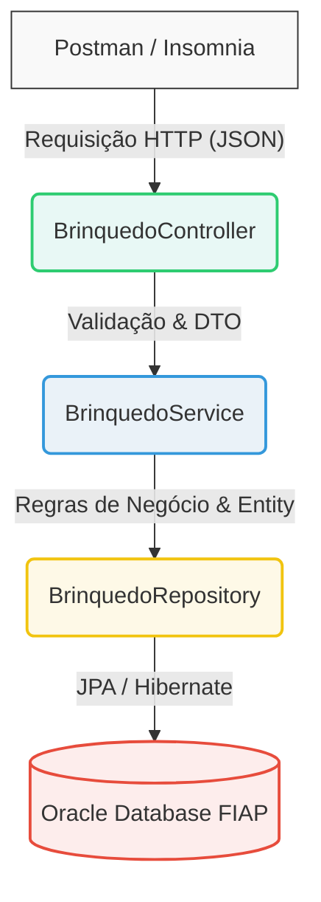

#  CP2 - API REST 


---

## 👥 Alunos

| Nome | RM |
1- RM563811 Paulo Henrique Alves Estalise
2- RM561337 Emanuel Italo
3- RM562012 Gabriel Bebe

---
## 🤳 Descrição

API REST para gerenciamento de **brinquedos infantis** (faixa etária de 0 a 14 anos), desenvolvida com **Spring Boot**, utilizando **JPA/Hibernate** para persistência de dados em **Oracle Database**.

A aplicação segue o padrão **CRUD** e boas práticas de desenvolvimento, como uso de **DTOs** para transferência de dados e **Bean Validation** para validação das entradas.

A API expõe endpoints no caminho `/brinquedos`, permitindo o consumo via ferramentas como Postman ou Insomnia. As requisições são processadas pela aplicação, que realiza a leitura e persistência dos dados na tabela `TDS_TB_BRINQUEDO` no banco Oracle, retornando respostas no formato **JSON**.


## ⚙️ Stack Tecnológico e Dependências

Abaixo estão listadas as principais tecnologias, frameworks e bibliotecas utilizadas para o desenvolvimento desta API:

| Tecnologia / Ferramenta | Versão | Descrição |
|-------------------------|--------|-----------|
| **Java** | 17 | Linguagem de programação principal do projeto. |
| **Spring Boot** | 3.2.5 | Framework base para a criação da aplicação de forma autoconfigurável. |
| **Spring Web** | 3.2.5 | Módulo utilizado para a construção da API RESTful e mapeamento de rotas. |
| **Spring Data JPA** | 3.2.5 | Módulo responsável pela persistência de dados e mapeamento ORM (Hibernate). |
| **Bean Validation** | Jakarta | Especificação utilizada para validar os dados de entrada nos DTOs. |
| **Oracle Database** | 19c+ | Banco de dados relacional utilizado para armazenar os registros. |
| **ojdbc11** | Runtime | Driver de conexão JDBC necessário para a comunicação com o Oracle. |
| **Maven** | 3.9+ | Ferramenta de build e gerenciamento de dependências (`pom.xml`). |

## 📁 Estrutura do Projeto

```
├── .idea/
├── .mvn/
│   └── wrapper/
│       └── maven-wrapper.properties
├── img/
│   ├── COLUNAS BD.png
│   ├── DADOS BD.png
│   ├── DELETE CP2.png
│   ├── GET BUSCANDO ITEM DELETADO.png
│   ├── GET CP2.png
│   ├── POST Cp2.png
│   ├── PUT CP2.png
│   └── TABELA CRIADA NO BD.png
├── src/
│   ├── main/
│   │   ├── java/fiap/com/br/cp2/
│   │   │   ├── controller/
│   │   │   │   └── BrinquedoController.java     
│   │   │   ├── dto/
│   │   │   │   └── BrinquedoDTO.java            
│   │   │   ├── entity/
│   │   │   │   └── Brinquedo.java               
│   │   │   ├── exception/
│   │   │   │   ├── BrinquedoNotFoundException.java  
│   │   │   │   └── GlobalExceptionHandler.java      
│   │   │   ├── repository/
│   │   │   │   └── BrinquedoRepository.java     
│   │   │   ├── service/
│   │   │   │   └── BrinquedoService.java        
│   │   │   └── Cp2Application.java              
│   │   └── resources/
│   │       ├── application.properties          
│   │       └── script.sql                       
│   └── test/
│       └── java/fiap/com/br/cp2/
│           └── Cp2ApplicationTests.java        
├── target/
└── integrantes.txt                              
```

---

## ⚙️ Configuração do Banco de Dados Oracle

Edite o arquivo `src/main/resources/application.properties`:

```properties
spring.datasource.url=jdbc:oracle:thin:@oracle.fiap.com.br:1521:ORCL
spring.datasource.username=
spring.datasource.password=
```


---

## 🗄️ Modelo de Dados (Script SQL)

A persistência do sistema é baseada em um banco de dados relacional. Execute o script abaixo (também disponível em `src/main/resources/script.sql`[cite: 2]) no seu **Oracle SQL Developer** para provisionar a estrutura necessária antes de iniciar a aplicação.

O modelo inclui a criação da tabela principal, *constraints* de integridade (chaves primárias e checagens lógicas) e a sequência responsável pela geração de IDs automáticos.
```sql
-- Criação da sequência para autoincremento do ID
CREATE SEQUENCE SEQ_BRINQUEDOS START WITH 1 INCREMENT BY 1 NOCACHE NOCYCLE;

-- Criação da tabela principal
CREATE TABLE TDS_TB_BRINQUEDO (
    ID_BRINQUEDO     NUMBER(10)    NOT NULL,
    NM_BRINQUEDO     VARCHAR2(100) NOT NULL,
    TP_BRINQUEDO     VARCHAR2(50)  NOT NULL,
    NR_CLASSIFICACAO NUMBER(2)     NOT NULL,
    DS_TAMANHO       VARCHAR2(20)  NOT NULL,
    VL_PRECO         NUMBER(10,2)  NOT NULL,
    
    -- Restrições (Constraints)
    CONSTRAINT PK_BRINQUEDO     PRIMARY KEY (ID_BRINQUEDO),
    CONSTRAINT CK_CLASSIFICACAO CHECK (NR_CLASSIFICACAO BETWEEN 0 AND 14),
    CONSTRAINT CK_PRECO         CHECK (VL_PRECO > 0)
);

---
##  Como Rodar o Projeto

### 📋 Pré-requisitos
Antes de começar, você precisará ter as seguintes ferramentas instaladas em sua máquina:
* **Java 17** ou superior
* **Maven 3.9+** (ou utilize o *wrapper* incluído no projeto)
* **Oracle SQL Developer** configurado e acessível
* **IntelliJ IDEA**, **Eclipse** ou **VS Code** (para visualização e execução do código)
* **Postman** ou **Insomnia** para testar os endpoints da API

---

### 🛠️ Passos para Execução

**1. Clone o repositório**
Abra o seu terminal e execute o comando abaixo para clonar o projeto:

```bash
git clone [https://github.com/Emanuel-italo/CP2-JavaBrinquedos.git]
cd CP2-Java
```

**2. Configure o banco de dados**
Edite `application.properties` com suas credenciais Oracle FIAP.

**3. Execute o script SQL**
Abra o Oracle SQL Developer e execute o arquivo `script.sql`.

**4. Rode a aplicação**
```bash
mvn spring-boot:run
```
Ou pela IDE: clique com o botão direito em `Cp2Application.java` → **Run**.

**5. A API estará disponível em:**
```
http://localhost:8080/brinquedos
```

---

# 🔔 Endpoints da API

Abaixo estão listadas as rotas disponíveis na aplicação para o gerenciamento de brinquedos. O mapeamento base do `BrinquedoController` é feito em `/brinquedos`[cite: 3].

### Base URL: `http://localhost:8080`

| Método | Endpoint | Descrição | Status de Resposta (Sucesso / Erro) |
|--------|----------|-----------|-------------------------------------|
| **GET** | `/brinquedos` | Lista todos os brinquedos cadastrados. | `200 OK` |
| **GET** | `/brinquedos/{id}` | Busca os detalhes de um brinquedo específico pelo ID. | `200 OK` / `404 Not Found` |
| **POST** | `/brinquedos` | Cria e persiste um novo brinquedo no banco de dados. | `201 Created` / `400 Bad Request` |
| **PUT** | `/brinquedos/{id}` | Atualiza os dados de um brinquedo existente. | `200 OK` / `404 Not Found` |
| **DELETE** | `/brinquedos/{id}` | Exclui um brinquedo específico do banco de dados. | `204 No Content` / `404 Not Found` |

---

## 🧪 Exemplos JSON para Postman / Insomnia

### ✅ POST — Criar Brinquedo
**URL:** `POST http://localhost:8080/brinquedos`
**Headers:** `Content-Type: application/json`

```json
{
  "id": 7,
  "nome": "Bicicleta Infantil Aro 16",
  "tipo": "Veículo",
  "classificacao": 5,
  "tamanho": "Grande",
  "preco": 450
}
```

**Resposta (201 Created):**
```json
{
  "id": 7,
  "nome": "Bicicleta Infantil Aro 16",
  "tipo": "Veículo",
  "classificacao": 5,
  "tamanho": "Grande",
  "preco": 450
}
```

---

### ✅ GET — Listar Todos
**URL:** `GET http://localhost:8080/brinquedos`

**Resposta (200 OK):**
```json
[
  {
    "id": 7,
    "nome": "Bicicleta Infantil Aro 16",
    "tipo": "Veículo",
    "classificacao": 5,
    "tamanho": "Grande",
    "preco": 450
  },
  {
    "id": 2,
    "nome": "LEGO Classic",
    "tipo": "Blocos de Montar",
    "classificacao": 6,
    "tamanho": "Grande",
    "preco": 199.90
  }
]
```

---

### ✅ GET — Buscar por ID
**URL:** `GET http://localhost:8080/brinquedos/1`

**Resposta (200 OK):**
```json
{
  "id": 7,
  "nome": "Bicicleta Infantil Aro 16",
  "tipo": "Veículo",
  "classificacao": 5,
  "tamanho": "Grande",
  "preco": 450
}
```

**Resposta (404 Not Found):**
```json
{
  "timestamp": "2026-05-01T10:30:00",
  "status": 404,
  "erro": "Não Encontrado",
  "mensagem": "Brinquedo não encontrado com ID: 99"
}
```

---

### ✅ PUT — Atualizar Brinquedo
**URL:** `PUT http://localhost:8080/brinquedos/1`
**Headers:** `Content-Type: application/json`

```json
{
  "id": 7,
  "nome": "Bicicleta Infantil Aro 16",
  "tipo": "Veículo",
  "classificacao": 5,
  "tamanho": "Grande",
  "preco": 450
}
```

**Resposta (200 OK):**
```json
{
  "id": 7,
  "nome": "Bicicleta Infantil Aro 16",
  "tipo": "Veículo",
  "classificacao": 5,
  "tamanho": "Grande",
  "preco": 450
}
```

---

#  DELETE 
**URL:** `DELETE http://localhost:8080/brinquedos/1`

**Resposta (204 No Content):** *(sem corpo)*

---

# ❌ Erro 400 

Ao enviar dados inválidos no POST ou PUT:

```json
{
  "timestamp": "2026-05-01T10:30:00",
  "status": 400,
  "erro": "Dados Inválidos",
  "mensagem": "Verifique os campos obrigatórios.",
  "campos": {
    "nome": "O nome do brinquedo é obrigatório.",
    "classificacao": "A classificação máxima é de 14 anos (infantil)."
  }
}
```

---

##  Validações..

Para garantir a integridade dos dados recebidos pela API antes que eles cheguem ao banco de dados, o objeto de transferência (`BrinquedoDTO.java`[cite: 3]) utiliza as anotações da especificação Jakarta Bean Validation.

As seguintes regras são aplicadas automaticamente nas requisições de criação (`POST`) e atualização (`PUT`):

| Campo | Anotações Utilizadas | Regras Aplicadas |
|-------|----------------------|------------------|
| `nome` | `@NotBlank`, `@Size` | Obrigatório. Deve conter entre 2 e 100 caracteres. |
| `tipo` | `@NotBlank`, `@Size` | Obrigatório. Deve conter entre 2 e 50 caracteres. |
| `classificacao` | `@NotNull`, `@Min`, `@Max` | Obrigatório. O valor deve estar entre 0 e 14 (anos). |
| `tamanho` | `@NotBlank`, `@Size` | Obrigatório. Deve conter entre 2 e 20 caracteres. |
| `preco` | `@NotNull`, `@DecimalMin` | Obrigatório. O valor deve ser maior que R$ 0,01. |


# Arquitetura

```

O projeto foi estruturado utilizando o padrão de arquitetura em camadas (Layered Architecture), o que garante um forte desacoplamento, facilita a manutenção e isola as responsabilidades de cada componente.

### Diagrama de Fluxo



